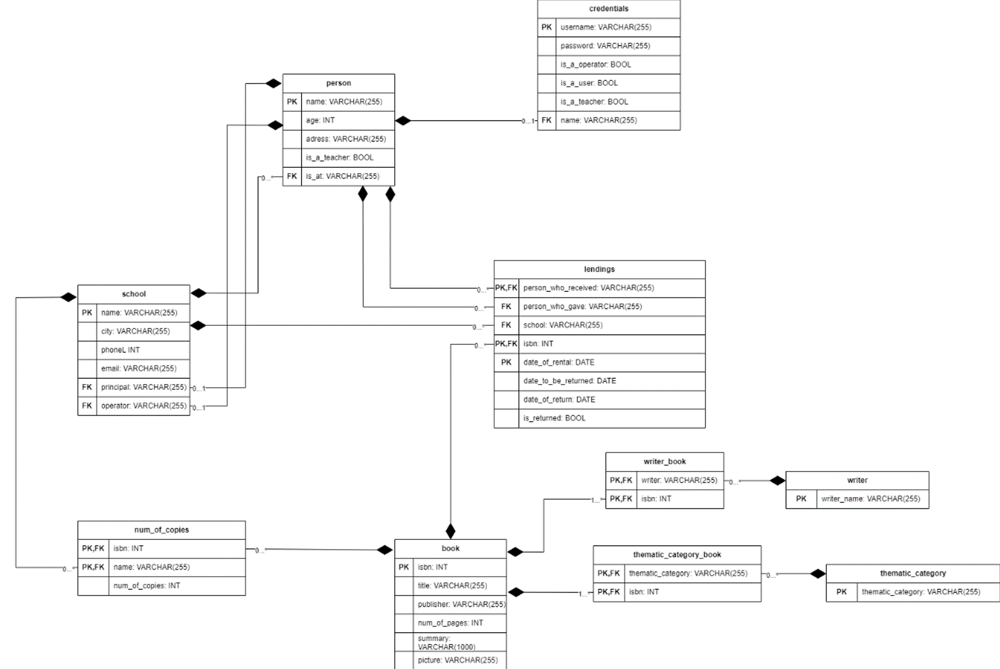
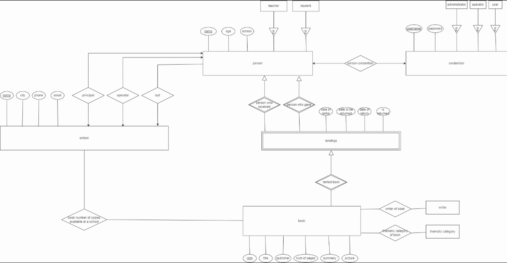

## Installing prerequisites

First install MySQL Workbench https://dev.mysql.com/downloads/installer/ 
and follow the recomended configuration 
#### Then install Node.js https://nodejs.org/en/download
## Getting ready...
open a folder in your editor and run 
- git clone https://github.com/mikedim95/DBproject.git 
#### The Database.sql file (DDL DML) is in the top level folder is the tested database. 
Insert it in MySqlWorkbench you previously installed and run it. 
Then press refresh at the left of the screen to see the database.
 Relational Diagram follows: 
ER_Diagram follows: 
After the sql script excecution make the query SELECT * FROM Credentials.The results will be the username and passwords for you to login and test the app. The 1 and 0 represent the role of every entry. This is the ER_Model of the database   and this is the relational diagram   
#### Now in the terminal 1:
- CD Front
- npm install
- npm start
#### In the terminal 2:
- CD Api
- npm install
- npm start
## Usage
After login you will be redirected to the corresponding page of each role. make sure the database name and username and password of the database service user are correct (Api/Routes/auth.js line 15-17) Each card represents a single query. Some of them require user input to work (the queries are hardcoded and there are '?' that are replaced with the user input using regex) In the ind the forged query is pushed to the back (routes/private) where it is used against the database which we configured earlier. The results are shown at the bottom (please refresh to reset)
